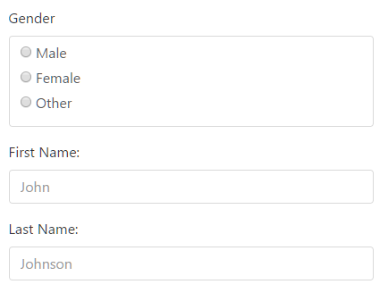
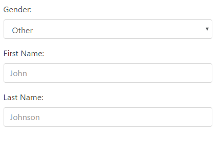
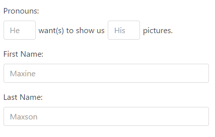
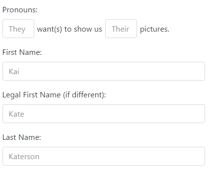

_Notice: if you disagree with the existence of nonbinary-identities, this article is not meant to convince you. So you might as well close this tab now instead of sending me a message_

With the rise of [societies acceptance of trans* and nonbinary gender identities](https://twitter.com/NatGeo/status/809800514791677952),
It's time to move away from the "2-genders" mindset - the same goes for webapps and forms.

## How it's been so far:

Most forms currently have a structure similar to this:

or this:

As you already might have guessed: You can't possible include all nonbinary genders into a list like this.
Besides this being impractical to realize UI-wise, having a 80+ item select, this also makes the backend/storage of the gender way to complex. 

## A possible solution

So here is my idea how to solve this:

Instead of asking for an explicit gender, simply asking for the preferred pronoun is way easier.
While this is obviously a big change, I feel like this would improve inclusion on the web.
Here is an example on how this could look:

In this case we use a sentence where we ask for the users pronouns in the subjective and possessive form,
allowing us to interact with the user using the correct pronouns.

## Names and legal names

In cases where you need the users legal name, for example when sending receipts,
including an optional text-field for the legal name is a good idea:

